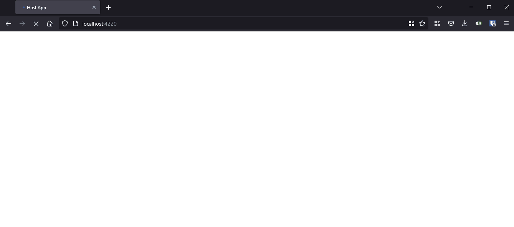

# Blazor Module Federation Sample

Sample of Blazor components exposed as microfrontends through Module Federation with the [Blazor.ModuleFederation.Angular nuget package](https://github.com/dgenezini/Blazor.ModuleFederation.Angular).

## Running the sample

1 - Execute the shell scripts below to compile and run the Blazor app and the Host app.

```bash {linenos=false}
run-blazor-mfe.sh && run-host.sh
```

2 - Access http://localhost:4220/

